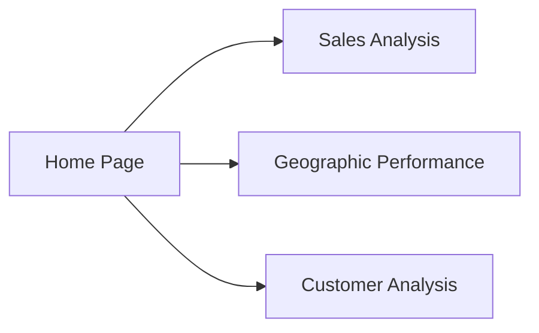

# 📊 Retail Superstore Analysis

## 🔍 Project Overview
Comprehensive retail sales data analysis to:
- Identify growth opportunities  
- Optimize logistics operations  
- Segment customers  

---

## 🗃️ Data Source
**Superstore Sales Dataset from Kaggle**  
🔗 [Link to data](https://www.kaggle.com/datasets/rohitsahoo/sales-forecasting)  
📆 Period: 2015–2018  
📝 12,994 records - 18 columns  

## 🔄 Analysis Process

### 1. Data Preparation
- Date format conversion (DD/MM/YYYY → SQL DATE)  
- Data quality validation  
- Anomaly detection (inconsistent dates, missing values)  

### 2. Core Analysis
- **Sales by category**: Identify top performers  
- **Monthly trends**: Month-over-month growth  
- **Geographical analysis**: Performance by region/state  

### 3. Advanced Analysis
- **RFM segmentation** of customers  
- **Logistics benchmark**: Delivery times by shipping mode    

---

## 💡 Key Insights

### 📌 Sales Performance

| Category     | % of Total Revenue | Recommendation               |
|--------------|--------------------|------------------------------|
| Furniture     | 48.27%             | Expand assortment             |
| Office Supplies | 29.09%         | Maintain                     |
| Technology    | 22.64%            | Targeted promotions          |

### 🚚 Logistics
- 100% of orders delivered on time  
- Average delivery time: **5 days (Standard Class)**  

### 📈 Growth
- **Growth peak**: June 2015 (+6592%)  
- Strong **seasonal trend** in **Q2**  

---

## 📊 Power BI Dashboard

### Key Features:
- Global KPI overview  
- Interactive geographic map  
- Customer RFM analysis  
- Product segment details  

### Visualizations:

## 📌 Strategic Recommendations
- Expand **furniture** offering (top category)  
- Leverage **Q2 seasonality**  
- Maintain **logistics excellence**  
- Target high-potential customers (**RFM segmentation**)  

## 📂 Project Files
- `superstore_analysis.sql` – Full SQL scripts  
- `dashboard.pbix` – Power BI file  
- `superstore.csv` - csv file
